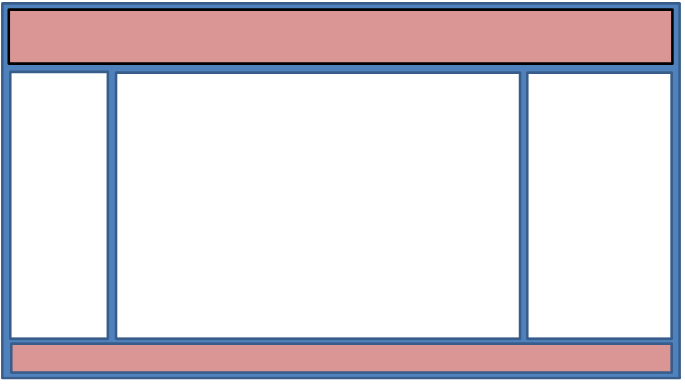

Lehrveranstaltung Multimediale Webprogrammierung  
Wintersemester 2024/25

Abgabe 08.11.2024

## Prüfungsvorleistung 1 – Boxdesign, Flexbox und Grid

Erstellen Sie eine Webseite mit drei verschiedenen Herangehensweisen unter Verwendung von plain HTML5 und CSS3. 
Suchen Sie sich hierfür ein technisches Produkt als Thema aus, was auf der Webseite vorgestellt, erklärt und verlinkt 
werden soll.

### 1. Die Webseite mit Boxmodel mit Float-CSS-Regeln umsetzen

### 2. Die Webseite mit Flex-Box CSS-Regeln umsetzen

### 3. Die Webseite mit Grid CSS-Regeln umsetzen

Die Webseite hat (für alle Teilaufgaben) folgende Anforderungen:

Die erste Reihe soll für den Titel der Seite benutzt werden. 

Die erste Spalte der zweiten Reihe, dient als Menüspalte, benötigt also eine Minimalbreite. Die beiden anderen Spalten 
sollen den Rest der Bildschirmbreite ausfüllen. Bei Verringerung der Gesamtbreite sollen die rechte und mittlere Spalte 
nacheinander nach unten „fallen“ und sich unter der Menüspalte und ggf. unter Menü- und zweiter Spalte (auf einer „Zeile“) 
in voller Bildschirmbreite anordnen. Füllen Sie die zweite und dritte Spalte mit jeweils 4 passenden Inhalten (Texte und Bilder). Diese sollen sich 
entsprechend den Spalten verhalten.

Die letzte Reihe dient als Footer Element, mit Verweis auf das Produkt, sowie die aktuelle Jahreszahl und nützlichen Links.

**Die Abgabe erfolgt als ein (1) zip-Archiv in OPAL.**