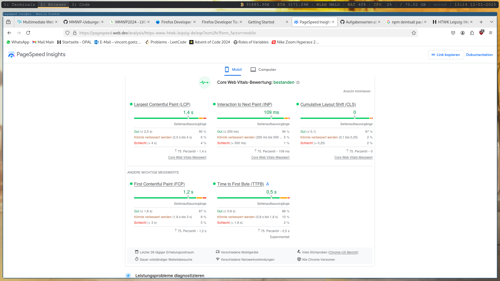
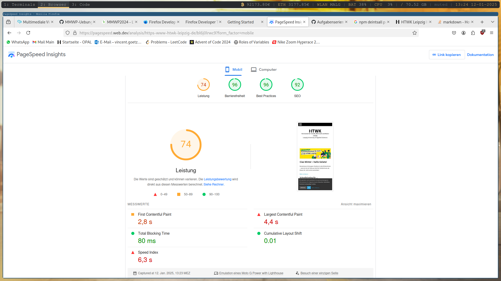
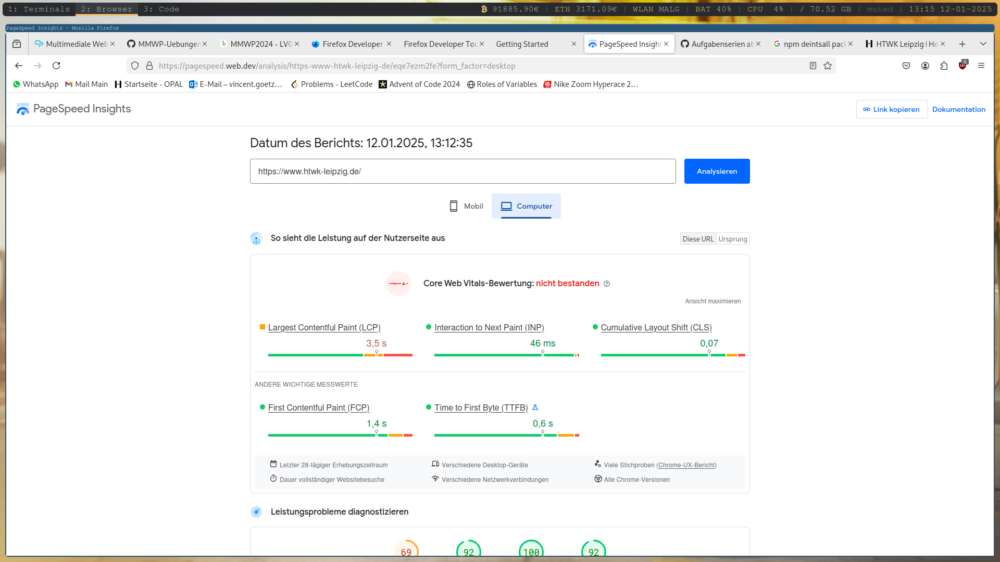
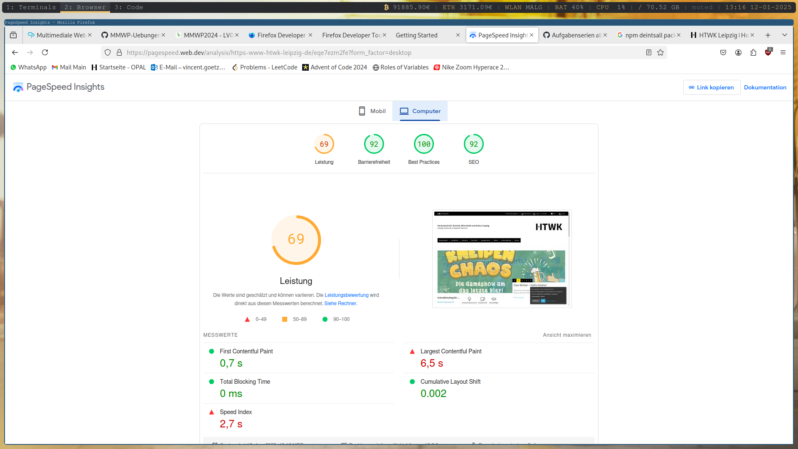

# Analyse HTWK-Webseite mit PageSpeed Insights

## Mobile

- Bewertung bestanden alles Super

- Leistung okay aber nicht super
- Barrierefreiheit, Best Practises und SEO fast perfekt
- erste Element rendert nach 2,8s 
- größte Element rendert nach 4,4s fertig
- alle Inhalte sichtbar nach 6,3s

## Computer

- nur LCP läd zu lange, deswegen nicht bestanden sonst top

- alles top bis auf LCP und Speed Index
- größte Element redert erst nach 6,5s fertig
- Speed Index zu hoch -> Elemente erscheinen zu Langsam

## Lösungsansätze
- First Contentful Paint verbessern
    - geht hauptsächlich um Schriftladezeit
        - heißt Schrift schnell laden und während des Webfont-Ladevorgangs sichtbar halten
- Speed-Index verbessern
    - Arbeit im Hauptthread minimieren
    - JS Ausführungszeit minimieren
    - Text, während des Webfont-Ladevorgangs sichtbar bleibt
- Largest Contentful Pain verbessern
    - TTFB (Time to first Byte) verringern 
    - Ladeverzögerung (Differenz TTFB und Zeitpunkt, bei dem Browser mit Laden LCP beginnt) verringern
    - Ladezeit der LCP verringern
    - Rendering-Verzögerung (Zeitspanne zwischen Ende Ladens LCP-Ressource und vollst. rendern des LCP) verringern
