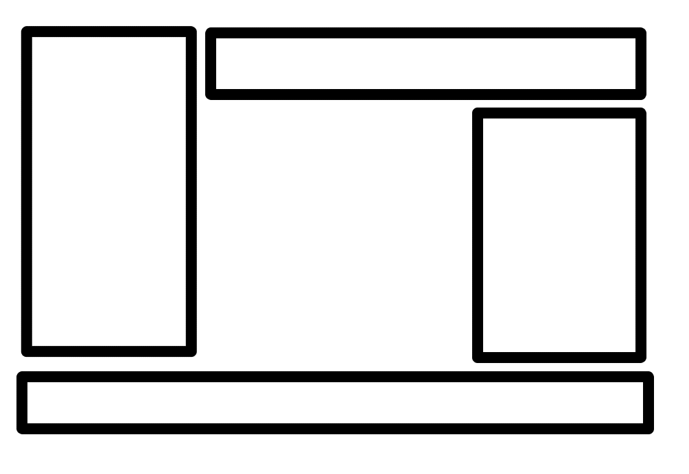
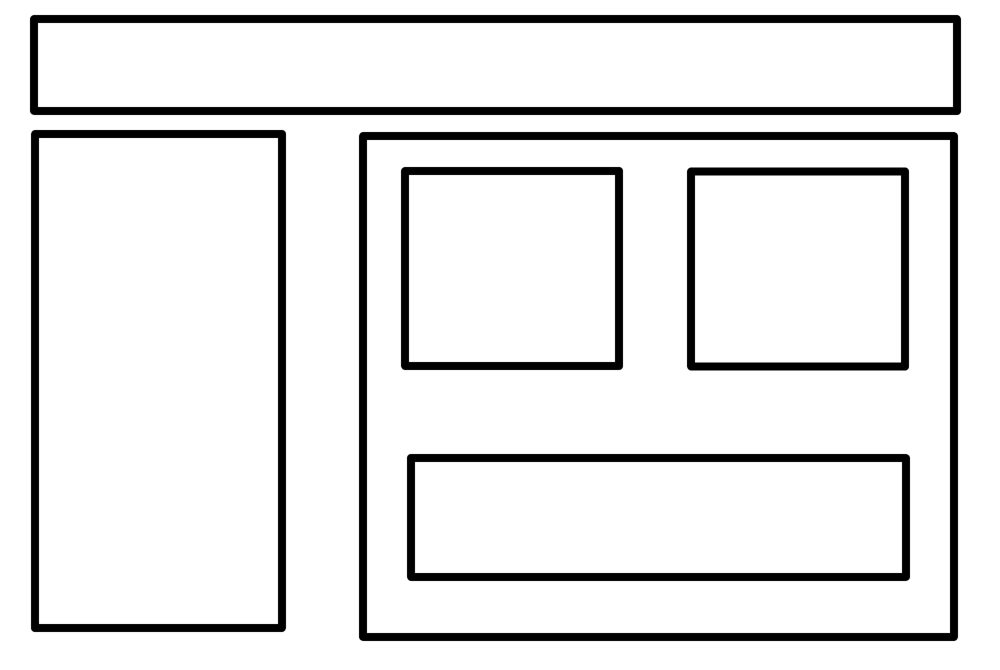

# MMWP2024 - Übungsserie 01 - HTML5 und CSS3

Lehrveranstaltung Multimediale Webprogrammierung   Wintersemester 2024/25

Link zum Kurs: https://bildungsportal.sachsen.de/opal/auth/RepositoryEntry/46557921282  
Zum Vertiefen der Kenntnisse: https://developer.mozilla.org/en-US/docs/Learn/CSS

### 1. Legen Sie eine HTML-Datei mit verlinkter CSS-Datei an und visualisieren Sie das Boxdesign, indem Sie den Rahmen der Boxen darstellen. Füllen Sie dazu die Datei mit einigen Elementen Ihrer Wahl.

Sie können alternativ Ihre Ergebnisse aus **Übung 00** weiterverwenden.

### 2. Zur Manipulation des Layouts stehen verschiedene Elemente zur Verfügung.

https://developer.mozilla.org/en-US/docs/Web/CSS/float

https://developer.mozilla.org/en-US/docs/Web/CSS/position

2.1 Fügen Sie Ihrer Webseite ein Bild hinzu. Platzieren Sie das Bild so, dass der Text rechts neben dem Bild und, nach Ende des Bildes, unter dem Bild angezeigt wird.

2.2 Platzieren Sie den Text & Bild – Block aus 2.1 50 Pixel rechts und 40 Pixel unterhalb des Dokumentbeginns. Nutzen Sie hierfür eine absolute Positionierung.

2.3 Machen Sie die Änderung aus 2.2 rückgängig. Platzieren Sie einen Text-Block („B“) links neben dem in 2.1 erstellten Block sowie einen Block („C“) rechts neben diesem.

### 3. Das Flexbox Layout vereinfacht die Formatierung in einer Reihe oder Spalte.

3.1 Legen Sie drei Paragrafen Tags an und umrahmen Sie diese mit einem div-Element.
Setzen Sie die display-Eigenschaft des div-Elements auf flex. Beobachten Sie die Veränderung mit und ohne diese Eigenschaft.

3.2 Setzen Sie die Eigenschaft flex-direction auf column und beobachten Sie die Veränderung.

https://developer.mozilla.org/en-US/docs/Web/CSS/flex-direction

3.3 Setzen Sie die Eigenschaft flex auf 1 für alle Paragrafen innerhalb des div-Elements.

Welchen Unterschied können Sie feststellen?

https://developer.mozilla.org/en-US/docs/Learn/CSS/CSS_layout/Introduction#setting_display_flex

3.4 Verkleinern und vergrößern Sie Ihr Browserfenster. Welches Verhalten können Sie feststellen?

### 4. Das Grid Layout ermöglicht die Vereinfachung des Designs von 2-Dimensionalen Layouts.

4.1 Legen Sie sechs Paragrafen Tags an und umrahmen Sie diese mit einem div-Element.
Setzen Sie die display-Eigenschaft des div-Elements auf grid.

Legen Sie ein Grid mit zwei Spalten und drei Zeilen und einem Platz von 10 Pixeln zwischen den Elementen an.

https://developer.mozilla.org/en-US/docs/Learn/CSS/CSS_layout/Introduction#grid_layout

https://developer.mozilla.org/en-US/docs/Web/CSS/gap

4.2 Modifizieren Sie Ihr Ergebnis aus 4.1 so, dass die Elemente der mittleren Zeile doppelt so hoch und breit sind, wie andere Elemente in Ihrem Grid.

https://developer.mozilla.org/en-US/docs/Web/CSS/CSS_grid_layout/Basic_concepts_of_grid_layout#the_fr_unit

4.3 Legen Sie vier neue Paragrafen, umgeben von einem div-Element an. Definieren Sie ein 3x3 Grid. Konfigurieren Sie die Paragrafen so, dass in der Mitte des Grids ein Freiraum von der Größe eines Grid-Elements besteht.

Nutzen Sie die Eigenschaften grid-column und grid-row für die Elemente im Grid.

https://developer.mozilla.org/en-US/docs/Web/CSS/grid-column

https://developer.mozilla.org/en-US/docs/Web/CSS/grid-row

### 5. Konstruieren Sie folgendes Design mithilfe von div-Elementen und Flexbox/Grid. Nutzen Sie relative Positionsangaben und vermeiden Sie absolute Werte wie Pixel. Testen Sie das Verhalten bei Verkleinerung des Browserfensters. Welches Verhalten können Sie beobachten?

### 6. Zeichnen Sie ein eigenes Webseitendesign auf und setzen Sie dieses dann mit Hilfe von CSS und HTML um. Nutzen Sie relative Positionsangaben und Werte und vermeiden Sie absolute Werte. Das Design soll 10 Elemente beinhalten. Nutzen Sie Grid und Flexboxen, um eine spannende Anordnung von Elementen und Unterelementen zu erzeugen. Lassen Sie sich ggf. von anderen Webseiten, Bildern oder Formen inspirieren.

## Selbststudienzeit/Weitere Schritte:

Nutzen Sie das CSS Tutorial von Mozilla zur weiteren Auseinandersetzung mit CSS:

https://developer.mozilla.org/en-US/docs/Learn/CSS
